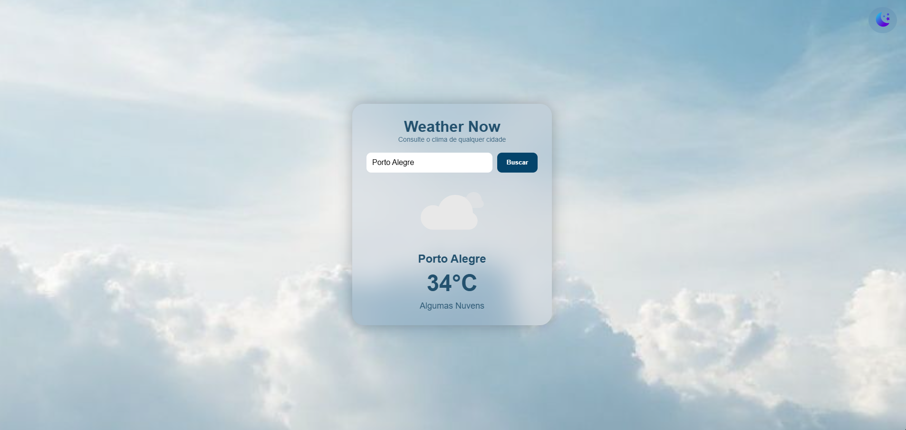

# 🌦️ [Weather Now](https://weather-now-jade-seven.vercel.app/)

Aplicação de clima desenvolvida com **JavaScript puro**, com foco em **clareza de código, experiência do usuário e evolução incremental.** O projeto consome a API da OpenWeatherMap e oferece uma experiência moderna com **dark mode, feedback visual, ícones animados e suporte PWA.**

---

## 🧠 Micro-história do projeto

### Situação

O *Weather Now* nasceu como projeto pessoal para praticar consumo de API, UI moderna, dark mode e PWA usando JavaScript puro.

### Incômodo

Com o tempo, o código passou a concentrar muitas responsabilidades em um único fluxo, utilizava alert() para erros e dificultava a evolução sem risco.

### Ação 

O projeto foi **refatorado de forma incremental**, sem reescrever tudo ou adicionar frameworks, com foco em:

* Separação clara de responsabilidades (dados, UI e estado)
* Código mais declarativo e previsível
* Feedback visual mais amigável
* Base sólida para evolução futura

### Aprendizado

Mais importante do que "funcionar" é o código ser **fácil de entender, manter e evoluir.** Código é um produto vivo — tanto para quem usa quanto para quem mantém.

---

## 🚀 Funcionalidades

* 🔍 Busca por cidade
* 🌡️ Temperatura em tempo real
* 📝 Descrição do clima em português
* 🎞️ ícones animados conforme condição climática
* 🌗 Tema claro / escuro com persistência
* ⌨️ Busca ao pressionar Enter
* 🔄 Loading state durante requisições 
* 🧠 Última cidade salva no localStorage
* 📱 Design responsivo (mobile-first)
* 📦 PWA instalável (Android, iOS e Desktop)

---

## 🧩 Decisões técnicas relevantes

### 1. Centralização de seletores de DOM

Todos os acessos ao DOM são feitos a partir de um único objeto, evitando *strings mágicas* espalhadas pelo código e melhorando a legibilidade.

```
const DOM = {
  cityInput: document.getElementById("cityInput"),
  searchBtn: document.getElementById("searchBtn"),
  cityName: document.getElementById("cityName"),
  temperature: document.getElementById("temperature"),
  description: document.getElementById("description"),
  weatherResult: document.getElementById("weatherResult"),
  weatherIcon: document.getElementById("weatherIcon"),
  themeBtn: document.getElementById("toggleTheme"),
};
```

### 2. Separação entre dados e UI

A busca de dados foi isolada da renderização, tornando o código mais previsível e fácil de evoluir.

```
async function fetchWeather(city) { /* API */ }
function renderWeather(data) { /* UI */ }
```

Benefícios:
* Facilita testes e manutenção
* Permite trocar API ou mockar dados
* Reduz risco de mudanças futuras

### 3. Feedback visual em vez de alert()

Erros agora são exibidos inline, mantendo o fluxo do usuário e melhorando a experiência, especialmente no mobile.

### 4. Ícones de clima declarativos

As condições climáticas são mapeadas de forma clara, facilitando manutenção e extensibilidade.

```
const WEATHER_ICONS = {
  clear: "clear.json",
  cloud: "clouds.json",
  rain: "rain.json",
  storm: "storm.json",
  thunder: "storm.json",
};
```

### 5. Tema (dark / light) previsível

A lógica de tema foi centralizada em uma única função, reduzindo duplicações e aumentando a previsibilidade do comportamento.

### 6. PWA com Service Worker de escopo correto

O cache foi ajustado para refletir corretamente a estrutura do projeto, evitando falhas silenciosas durante a instalação.

```
cache.addAll([
  "./",
  "./index.html",
  "./style.css",
  "./js/script.js",
  "./manifest.json"
]);
```

---

## 🛠 Tecnologias Utilizadas

* HTML5
* CSS3 (glassmorphism, responsividade)
* JavaScript (ES6+)
* OpenWeather API
* Lottie Animations
* Service Worker + Manifest (PWA)
* Git & GitHub

---

## 📸 Preview



---

## 📦 Como executar localmente

```
git clone https://github.com/UelintonHJ/weather-now
cd weather-now
# abrir index.html no navegador
```

---

## 🔑 Configuração da API (opcional)

Para usar sua própria chave da OpenWeather:

```
const apiKey = "SUA_API_KEY";
```

Criar gratuitamente em: https://openweathermap.org/api

---

## 🧑‍💻 Autor

**Uelinton Janke** <br />
Desenvolvedor Front-end com foco em produto <br />
LinkedIn: [https://www.linkedin.com/in/uelinton-janke/](https://www.linkedin.com/in/uelinton-janke/)
