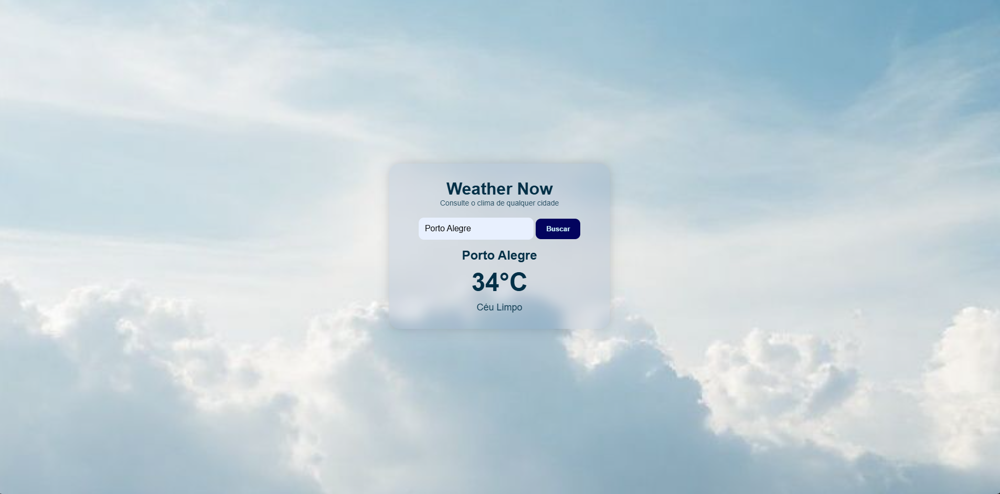

# 🌦️ [Weather Now](https://uelintonhj.github.io/weather-now/)

Weather Now é um aplicativo simples e moderno para consultar o clima em qualquer cidade do mundo utilizando a API pública da OpenWeatherMap.
O projeto foi desenvolvido com foco em **responsividade**, **design clean**, **acessibilidade** e **performance**, além de incluir versão **PWA**, permitindo a instalação como app no celular ou desktop.

---

## 🚀 Funcionalidades

- 🔍 Busca por cidade
- 🌡️ Exibição de temperatura atual
- 🌥️ Descrição detalhada do clima
- 🎨 Tema claro/escuro
- ✨ ícones animados de acordo com o clima
- 🧊 Design minimalista com efeito *glassmorphism*
- 📱 Totalmente responsivo (mobile first)
- 📦 PWA: instalável no Android, iOS e Desktop

---

## 🛠 Tecnologias Utilizadas

- HTML5
- CSS3
- JavaScript
- OpenWeather API
- Service Worker (para PWA)
- Manifest.json

---

## 📸 Preview



---

## ⚙️ Como Rodar o Projeto Localmente

```
git clone https://github.com/UelintonHJ/weather-now
cd weather-now
```

Abra o index.html no navegador ou use uma extensão de Live Server.

---

## 🔑 Configuração da API

Crie uma conta gratuita:
https://openweathermap.org/api

Depois, coloque sua chave em:

```
const apiKey = "SUA_API";
```

---

## 📱 Instalação como PWA

1. Acesse o site pelo navegador no celular/desktop
2. Clique no botão "Istalar App" ou "Adicionar à tela inicial"
3. Pronto - o Weather Now vira um app!

---

## 🧑‍💻 Autor

Criado por **Uelinton Janke**
