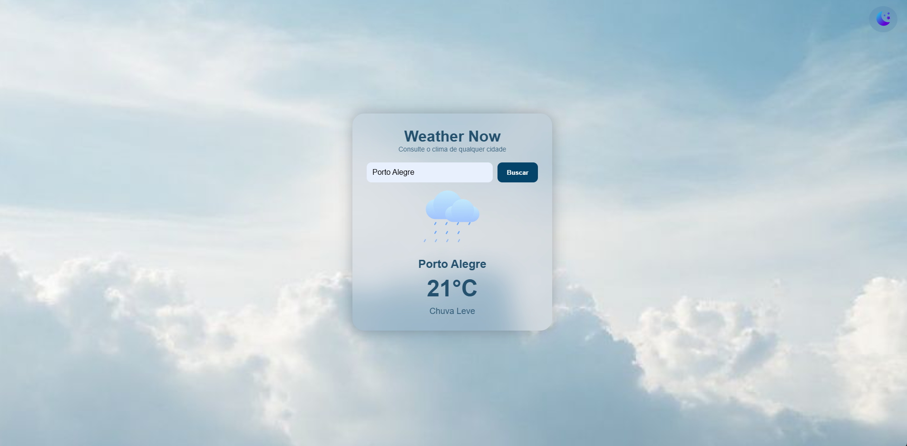

# 🌦️ [Weather Now](https://weather-now-jade-seven.vercel.app/)

Aplicação de clima que permite consultar temperatura, descrição e ícones dinâmicos de qualquer cidade do mundo, utilizando a API pública da OpenWeatherMap. O projeto tem foco em **responsividade**, **design clean**, **acessibilidade** e conta com versão **PWA**, podendo ser instalado como aplicativo.

---

## 🚀 Funcionalidades

- Busca por cidade
- Temperatura em tempo real
- Descrição detalhada do clima
- Tema claro/escuro
- ícones animados de acordo com o clima
- Design *glassmorphism*
- Totalmente responsivo 
- PWA instalável (Android, iOS e Desktop)

---

## 🛠 Tecnologias Utilizadas

- HTML5
- CSS3
- JavaScript
- OpenWeather API
- Service Worker (para PWA)
- Manifest.json
- Git & GitHub

---

## 📸 Preview



---

## 📦 Como executar o projeto

```
git clone https://github.com/UelintonHJ/weather-now
cd weather-now
abrir o index.html no navegador
```
Ou acesse a versão hospedada:
https://weather-now-jade-seven.vercel.app/

---

## 🔑 Configuração da API (opcional)

Para rodar com sua própria chave:
```
const apiKey = "SUA_API";
```
Cadastrar gratuitamente em: https://openweathermap.org/api

---

## 📚 Aprendizados

Neste projeto aprendi a consumir APIs externas usando **fetch()**, trabalhar com **resposividade mobile-first**, implementar **tema claro/escuro**, criar **PWA** com Service Worker e melhorar minha organização de layout usando efeitos visuais modernos como *glassmorphism*.

---

## 🧑‍💻 Autor

**Uelinton Janke**

LinkedIn: https://www.linkedin.com/in/uelinton-janke/
